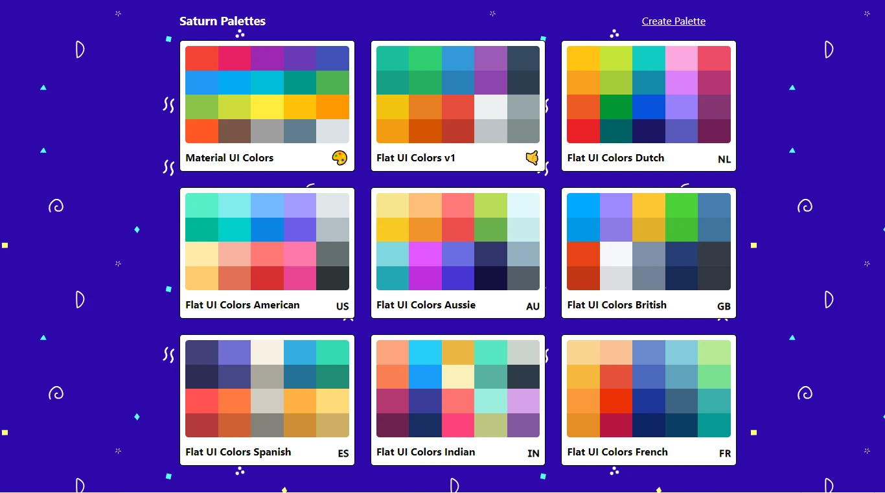

<h1 align='center'>🎨 React Colors App</h1>
<h2 align='center'>
  <br>
  <span>🔗</span><a href='https://colors-react-app-dusky.vercel.app'>Live Demo</a>
</h2>

<h2>📘 About</h2>
<h3>
It is an application to create, store and collect color palettes. Helping professionals manage color schemes in ideas and projects.
</h3>

## 🔨 Tools
- [React](https://pt-br.legacy.reactjs.org/)
- [JavaScript](https://www.javascript.com/)
- [HTML](https://developer.mozilla.org/pt-BR/docs/Web/HTML) 
- [CSS](https://developer.mozilla.org/pt-BR/docs/Web/CSS)

## ♻ How to Contribute

 ```bash
 $ git clone https://github.com/devjeanfraga/react-colors-app
 ```

 ```bash 
 $ cd react-colors-app
 ```

```bash 
 $ npm install
 ```

 <p>OR</p>

  ```bash 
 $ yarn install
 ```
<br>
<br>
